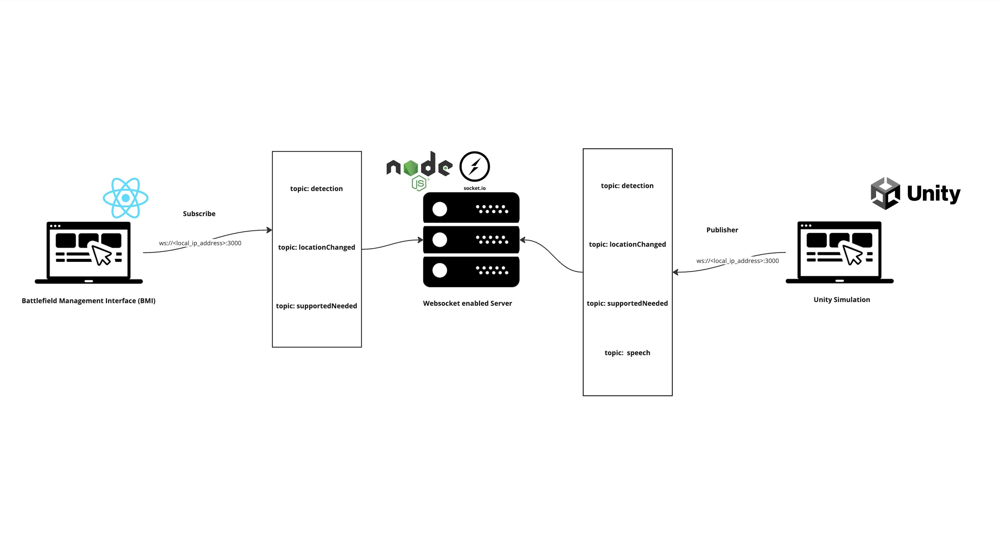

## Description

This is the backend for the game. It is a simple server that listens for events and sends them to the frontend.

## Technologies

- Node.js
- Express
- Socket.io
- Zod

## Run

```bash
npm install
npm run start
```
